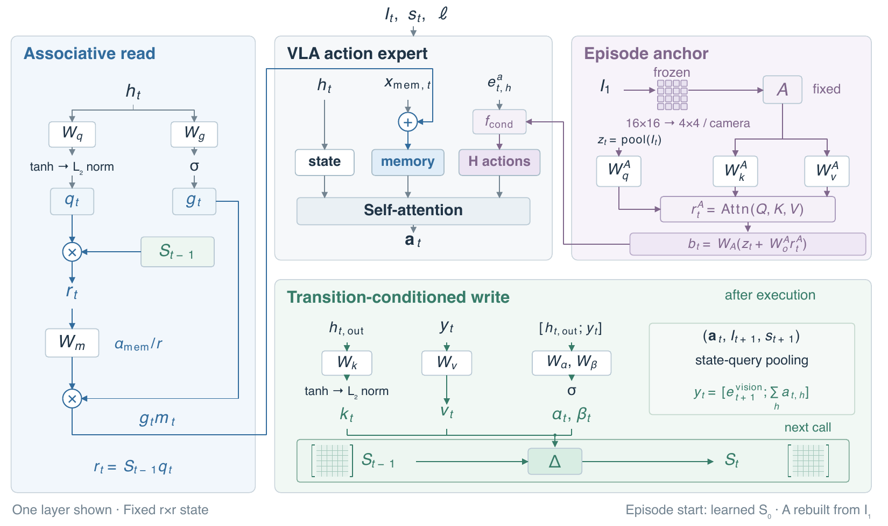

# MemBodied

Official implementation of **MemBodied: Recurrent Associative Memory for Vision-Language-Action Models**.

MemBodied gives a vision-language-action (VLA) policy fixed-capacity episodic memory. It preserves information that is no longer visible in the current observation without including past observations in the model context. This release contains the paper's π₀ and π₀.₅ RMBench implementations and the π₀ LIBERO configuration.

## Why episodic memory?

Most VLA policies generate an action chunk from the current observation and language instruction, then discard that observation before the next policy call. Action chunking improves short-horizon consistency but does not preserve information across calls. This creates **temporal state aliasing**: two similar current observations can require different actions because of something that happened earlier. For example, after moving an object, the current scene may no longer reveal the object's original location even though a later instruction requires returning it.

Keeping the complete observation history can recover this information, but its storage, context length, and inference cost grow with the episode. A fixed window bounds the cost but forgets evidence after it leaves the window. MemBodied instead compresses task-relevant episode history into a recurrent state whose capacity and access cost do not grow with episode length.

## Architecture

<p align="center">
  <a href="assets/architecture.pdf">
    
  </a>
</p>

<p align="center"><em>MemBodied conditions each policy call on the current input, an associative state memory, and a persistent initial-scene anchor.

MemBodied separates episode memory into two complementary pathways:

1. **Associative state Memory.** Layer-wise associative matrices store interactions across policy calls through learned read and write interfaces. After a call, the model combines the action chunk with its observed visual consequence and writes that interaction using a gated delta update. On the next call, the current state queries the matrices and the retrieved information conditions action generation.
2. **Initial-scene anchor.** Recurrent updates can overwrite fine-grained evidence from early in an episode. A separate, compact representation of the initial scene remains available throughout the episode and supplies a stable reference for details such as original object locations.

The two pathways are trained with the policy's native action objective; no auxiliary memory labels or retrieval pipeline are required. Their state is reset at episode boundaries, while their footprint and per-call access cost remain independent of episode length.

## Repository layout

- `RMBench/`: the complete simulator and task set.
- `RMBench/policy/pi0/`: π₀ MemBodied, MemBodied-AS, MemBodied-H, ablations, and LIBERO.
- `RMBench/policy/pi05/`: π₀.₅ MemBodied.

The two policy directories are separate Python projects. Activate the environment for the backend selected during evaluation.

## Model configurations

| Config | Paper setting |
|---|---|
| `membodied` | Memory-Token model with associative state and initial-scene anchor |
| `membodied_no_anchor` | Memory-Token Model without the anchor |
| `membodied_as` | MemBodied-AS attention steering |
| `membodied_h` | MemBodied-H with the LSTM cell |
| `membodied_vision_only` | vision-only memory value |
| `membodied_action_only` | action-only memory value |
| `membodied_first_frame` | full-resolution first-frame ablation |
| `membodied_pi05` | π₀.₅ MemBodied |
| `membodied_libero` | π₀ LIBERO experiment with five-step replanning |

The RMBench defaults use associative rank 128 and scale 256. Use CLI overrides for rank studies, dataset IDs, and sequence length. Sequence lengths are 8 for `put_back_block` and `rearrange_blocks`; 14 for `battery_try` and `swap_blocks`; and 18 for `block_ranking_try`.

## Setup

Install the simulator according to [RMBench/README.md](RMBench/README.md). Create one locked policy environment at a time:

```bash
cd RMBench/policy/pi0
uv sync --frozen
```

or:

```bash
cd RMBench/policy/pi05
uv sync --frozen
```

## Data and training

Set a public Hugging Face repository ID through the CLI instead of editing source. The retained entry points are:

```bash
uv run scripts/process_data.py --help
uv run scripts/compute_norm_stats.py --config-name membodied
uv run scripts/train.py membodied --exp-name EXPERIMENT
```

Use overrides such as `--data.repo-id ORG/DATASET`, `--model.sequence-len 14`, or `--model.memory-rank 64` to adjust config parameter or create a new configuration.

For LIBERO, see [the focused example](RMBench/policy/pi0/examples/libero/README.md). The `membodied_libero` config uses sequence length 6, for training and ten interleaved recurrent slots for five-step replanning.

## RMBench evaluation

Edit the selected backend's `deploy_policy.yml` or provide equivalent CLI overrides:

```yaml
backend: pi0             # pi0 or pi05
config_name: membodied
checkpoint_dir: /path/to/checkpoint
asset_id: null
action_chunk_size: 50
```

`checkpoint_dir` may instead be supplied through `MEMBODIED_CHECKPOINT_DIR`. A missing value fails with a clear error.


